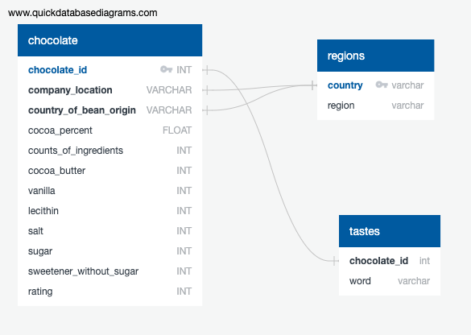

# Chocolate Lovers
Boot Camp Challenge

### Data Source:
We'll be using the chocolate.csv data file.
https://www.kaggle.com/datasets/soroushghaderi/chocolate-bar-2020?select=chocolate.csv
* 10 columns with features, with 3 that will be broken into bins
* Ratings is our Output for our classification.

### Database schema:

Entity Relationship diagram for chocolate_lovers database. 

### Questions:
* How does the percent of Cocoa & the origin of the Bean impact the rating?
* Where do the highest rank beans come from?
* What is impact of ingredients on ratings?

### Visualizations:
* Map of the countries with highest rated chocolate or best beans.

* Pie chart to show top rated chocolates by ingredient and / or country.

* Avg rating by country or region.

* Tastes related to ratings & visualization of common words

### Models:
Random Forrests model, resulted in 100% accuracy; however, did not separate the data set into training and testing sets. Also, rounded the ratings and encoded the columns with countries. 
Encoded DF

Preliminary data preprocessing
* Shape of the data (2224 rows and 21 columns)
* Dtypes
* Dropped the following columns ("ref", "company", "review_date", "specific_bean_origin_or_bar_name", "beans","first_taste","second_taste", "third_taste", "fourth_taste"). Cannot determine what information was conveyed in “ref” column; the columns that addressed taste will be analyzed separately; “beans” was dropped because it included the name of the bean and we are interested in countries;  review date was not necessary for rating generalization; and “specific_bean_origin_or_bar_name” had many unique entries since this column included possible bar names or bean origin. 
* Checked the dataset for missing values (there were none)
* Checked the dataset for unique value counts in each column. 

Preliminary feature engineering and preliminary feature selection including their decision-making process
* Remaining columns after dropping are features and “rating” column as outcome
* For the country that produced the bar feature, we used the top 6 producers (U.S.A., France, Canada, U.K., Italy, and Belgium) and put the rest in the “Other” category since these countries  had less than 50 entries. This feature was encoded. 
* For the producer, we used top 6 top bean producers and put the rest of the countries into the “Others” category since they did not have more than 60 entries. This feature was encoded. 
* One of the features “cocoa_percent” was scaled since the values in this column varied from 42.0 to 100.0 and were significantly larger than any other values in the data frame. 
* Used get_dummies function for the remaining ingredient columns.
Description of how data was split into training and testing sets 
* Data was split as follows 75%-training and 25% testing
Explanation of model choice, including limitations and benefit
* The preliminary model was Random Forests
* One of the limitations of the model is that it did not perform well with ratings 2 and 4 due to not many chocolate bars rated as 2 and 4. Many ratings were spread around 3.5, so the model did well with being able to predict if the chocolate bar would be rated as 3. 
* Some of the benefits of this model is that it is one of the most efficient classification models that can take into account many different features to produce a good prediction model.

* After splitting the data into training and testing sets, the model performed fairly well with prediciting the chocolate bars with raiting 3. 

* Feature importances: 0-company_location, 1-company_of_bean_origin, 2-cocoa_percent
* 

### Dashboard:

Our dashboard will be created in Tableau to demonstrate the origins of beans of the top rated chocolates and the top tastes used to describe those chocolates. You'll be able to filter the rating of chocolates to see correlating information.

### Team Communication Strategy:
Slack & Zoom
